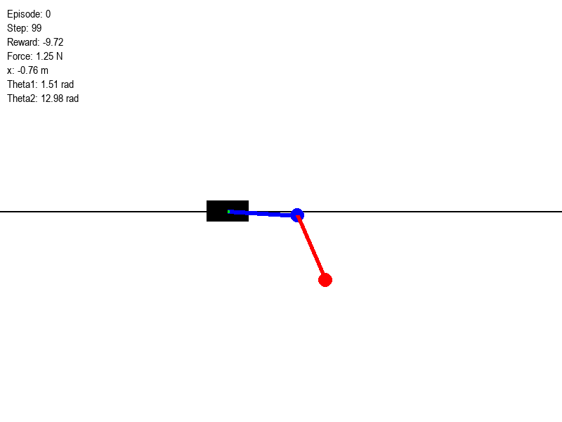
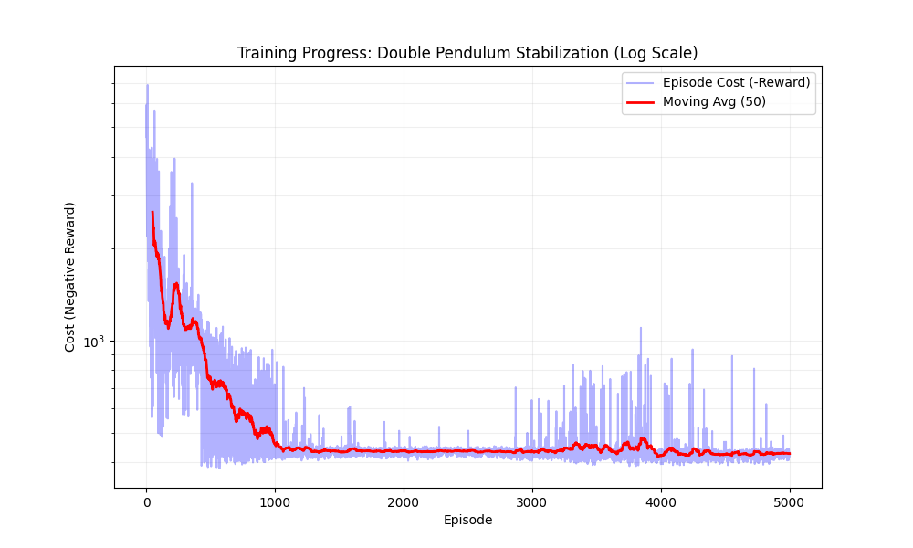

# Double Pendulum Stabilization with Reinforcement Learning

## 1. Project Objective
The goal of this project is to stabilize a **double pendulum on a cart** in the unstable upright equilibrium position ($\theta_1 = \pi, \theta_2 = \pi$) using Deep Reinforcement Learning (PPO). This system is a classic benchmark in control theory due to its high nonlinearity and chaotic dynamics.



## 2. Training Methodology
We use **Proximal Policy Optimization (PPO)**, a state-of-the-art Deep Reinforcement Learning algorithm.



*   **Architecture**: The agent uses a **Neural Network** (Multi-Layer Perceptron) with two heads:
    *   **Actor (Policy)**: Outputs the mean and standard deviation of a Gaussian distribution for the action (force). This allows the agent to "explore" the state space stochastically.
    *   **Critic (Value)**: Estimates the expected future reward from the current state, used to compute the "advantage" of an action.
    *   **Critic (Value)**: Estimates the expected future reward from the current state, used to compute the "advantage" of an action.
*   **Exploration**:
    *   **Stochastic Policy**: The agent samples actions from a Gaussian distribution.
    *   **Zero-Mean Initialization**: The policy is initialized to be unbiased (zero mean), ensuring the agent explores both directions (Left/Right) equally at the start.
    *   **Perturbations**: We can introduce **Wind** (continuous noise) and **Impulses** (sudden pushes) to force the agent to learn robust stabilization strategies.

## 3. Mathematical Formulation

### 3.1 System Dynamics
The system consists of a cart of mass $M$ moving on a 1D track, with two links of mass $m_1, m_2$ and length $l_1, l_2$.

**Generalized Coordinates**:

$$
q = [x, \theta_1, \theta_2]^T
$$

where $x$ is the cart position, and $\theta_i$ are the angles from the vertical down position.

**Lagrangian Mechanics**:
The Equations of Motion (EOM) are derived from the Euler-Lagrange equation:

$$
\frac{d}{dt} \left( \frac{\partial \mathcal{L}}{\partial \dot{q}} \right) - \frac{\partial \mathcal{L}}{\partial q} = \tau
$$

where $\mathcal{L} = T - V$.

This yields the standard robotic manipulator form:

$$
M(q)\ddot{q} + C(q, \dot{q})\dot{q} + G(q) = B u
$$


*   **Inertia Matrix** $M(q)$: Symmetric, positive-definite matrix encoding the mass distribution and coupling between links.
*   **Coriolis & Centrifugal Matrix** $C(q, \dot{q})$: Contains terms like $\dot{\theta}_i^2$ and $\dot{\theta}_1 \dot{\theta}_2$.
*   **Gravity Vector** $G(q)$: Derived from potential energy $V(\theta)$.
*   **Control Input** $u$: The force $F$ applied to the cart.

For the full derivation, see [docs/physics_derivation.md](docs/physics_derivation.md).

### 3.2 State Space
The RL agent observes the full state vector:

$$
\mathbf{s} = [x, \sin\theta_1, \cos\theta_1, \sin\theta_2, \cos\theta_2, \dot{x}, \dot{\theta}_1, \dot{\theta}_2]
$$

*Note: We use $\sin/\cos$ of angles to avoid discontinuity at $\pm \pi$.*

### 3.3 Reward Function
The objective is to maximize the cumulative reward:

$$
J(\pi) = \mathbb{E}_{\tau \sim \pi} \left[ \sum_{t=0}^T \gamma^t r(s_t, a_t) \right]
$$


The reward function $r(s, a)$ is designed to penalize deviation from the upright equilibrium:

$$
$$
r = \exp \left( - (w_1 \theta_{1,err}^2 + w_2 \theta_{2,err}^2 + w_3 x^2 + w_4 \|\dot{q}\|^2) \right)
$$

*   **Rewarded ($r \to 1.0$)**: Perfectly upright ($\theta = \pi$), centered ($x=0$), and stationary.
*   **Penalized ($r \to 0.0$)**: Deviating from the target state.
*   **Neutral/Survival**: Staying alive (even at the bottom) yields a small positive reward ($>0$), which is strictly better than crashing (reward $0$), preventing the "suicide bug" where the agent crashes intentionally to avoid negative penalties.
$$


## 4. Project Structure & Separation
The project is strictly separated into **Simulation (Physics)** and **Agent (Brain)**:

```
double_pendulum_stabilization/
├── src/
│   ├── env/                # SIMULATION (The World)
│   │   └── double_pendulum.py  # Physics engine, EOMs, RK4 integrator.
│   ├── agent/              # AGENT (The Brain)
│   │   └── ppo.py              # Neural Network architecture & PPO algorithm.
│   ├── train.py            # TRAINING (The School)
│   │   └── ...                 # Connects Env and Agent for learning.
│   └── simulate.py         # INFERENCE (The Test)
│       └── ...                 # Runs the Agent in the Env without learning.
├── docs/                   # Documentation
│   ├── physics_derivation.md
│   └── visualization.md
└── ...
```

## 5. Usage

### Installation
```bash
git clone https://github.com/kyleyhw/double_pendulum_stabilization.git
cd double_pendulum_stabilization
python -m venv venv
# Activate venv (Windows: venv\Scripts\activate, Unix: source venv/bin/activate)
pip install -r requirements.txt
```

### Running
*   **Train**: `python src/train.py`
*   **Visualize**: `python src/simulate.py`
**Progress Montage**:
To see the agent's improvement over time (requires multiple checkpoints in `logs/`):
```bash
# View on screen
python src/visualize_progress.py

# Save as GIF
python src/visualize_progress.py --save_gif --output docs/images/training_montage.gif
```

### Robustness Testing
You can test the agent's stability against external forces (wind, pushes).
See [docs/robustness.md](docs/robustness.md) for details.

```bash
# Run with wind
python src/simulate.py --wind 2.0

# Use Left/Right Arrow keys to push the cart during simulation.
```
