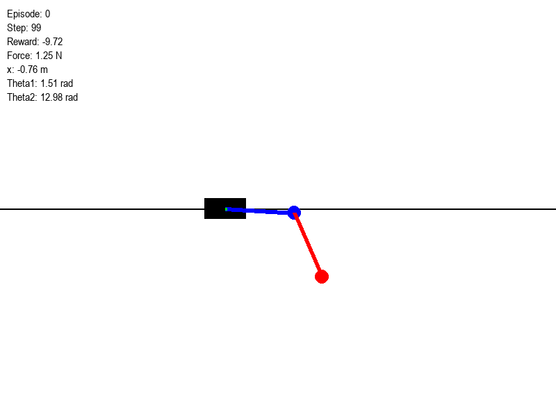

# Cart-Pendulum Stabilization with Reinforcement Learning

A reinforcement-learning study of swing-up and stabilization of a cart-pendulum
(single and double) at the unstable upright equilibrium ($\theta_i = \pi$),
using a from-scratch PPO implementation with curriculum learning, GAE-$\lambda$,
tanh-squashed Gaussian policies, observation normalisation, and vectorised
rollouts.



## 1. Repository structure

```
double_pendulum_stabilization/
├── src/
│   ├── env/
│   │   ├── cart_pendulum_base.py    # CartPendulumBase: shared dynamics shell
│   │   ├── single_pendulum.py       # 1-pole subclass
│   │   ├── double_pendulum.py       # 2-pole subclass (the headline task)
│   │   └── double_pendulum_goal.py  # goal-conditioned variant (Phase 6)
│   ├── strategies/
│   │   ├── controls.py              # ForceControl, VelocityControl
│   │   └── rewards.py               # *Standard, ExponentialSwingUp, EnergyShaping
│   ├── agent/ppo.py                 # PPO + GAE + tanh squash + minibatches
│   ├── control/                     # LQR baseline + controllability check
│   ├── utils/
│   │   ├── normalize.py             # RunningMeanStd + NormalizeObservation
│   │   ├── schedules.py             # linear / cosine schedules
│   │   └── visualizer.py            # Pygame renderer
│   ├── train.py                     # vectorised PPO trainer
│   ├── simulate.py                  # play a checkpoint with optional MP4 recording
│   ├── evaluate_diagnostics.py      # deterministic-policy report
│   └── generate_report.py           # builds learning curve + final-run + montage
├── tests/
│   ├── test_physics.py              # energy conservation under RK4
│   ├── test_components.py           # PPO, normaliser, integrators, bounds
│   └── test_energy_reward.py        # EnergyShapingReward
├── docs/                            # derivations, images, training reports
├── pyproject.toml                   # uv project, dev tooling (ruff, ty)
└── .pre-commit-config.yaml          # ruff + ty + detect-secrets
```

## 2. Mathematical formulation

### 2.1 Dynamics

Generalised coordinates $q = [x, \theta_1, \dots, \theta_N]^\top$, where each
$\theta_i$ is measured from the *downward* vertical. The Lagrangian
$\mathcal L = T - V$ produces, via the Euler–Lagrange equations, the standard
manipulator form

$$ M(q)\ddot q + C(q,\dot q) + G(q) = B u, \qquad B = [1,\ 0,\ \dots,\ 0]^\top. $$

Only the cart is actuated, so the system is **underactuated** for $N \ge 1$. The
upright equilibrium $\theta_i = \pi$ is unstable; the controllability of the
linearised system at this fixed point is verified numerically in
`docs/controllability_analysis.md`.

The integrator is selectable: classical 4th-order Runge–Kutta (default) or
*semi-implicit (symplectic) Euler* for long-horizon energy fidelity.

### 2.2 Observation, action, reward

Observation (double pendulum, 8-D):

$$ \mathbf s = [x,\ \sin\theta_1,\ \sin\theta_2,\ \cos\theta_1,\ \cos\theta_2,\ \dot x,\ \dot\theta_1,\ \dot\theta_2]. $$

The $\sin/\cos$ encoding eliminates the $\pm\pi$ wraparound. Observations are
standardised through a running-mean/var wrapper, with state saved in the
checkpoint.

Action: a single scalar $a_t \in [-1, 1]$ produced by a tanh-squashed Gaussian
policy. The control strategy maps the action to a physical force:

* `ForceControl`: $F = a_t \cdot F_{\max}$.
* `VelocityControl` (default): high-gain P-controller tracking
  $v_{\rm cmd} = a_t \cdot v_{\max}$, approximating an ideal velocity source.

Reward strategies:

* `ExponentialSwingUpReward` (default): rewards the *duration* of an unbroken
  upright run, $r_t = (\exp(\min(T_{\rm up}, T_{\rm cap})) - 1) \cdot P_x(x;\delta)$,
  with the centring term $P_x$ tightening with curriculum.
* `*StandardReward`: sparse +1 per upright step, plus an optional smooth
  survival bonus $\alpha\cos\theta_1\cos\theta_2$ providing a gradient
  outside the threshold band.
* `EnergyShapingReward`: convex combination of an energy-error Gaussian, a
  spatial alignment Gaussian, and a kinetic-damping term gated near upright;
  provides a *global* gradient on the homoclinic manifold (Tedrake-style
  swing-up).

### 2.3 PPO with GAE

For a trajectory of length $T$ with rewards $r_t$ and value estimates
$V_\phi(s_t)$,

$$ \delta_t = r_t + \gamma\,V_\phi(s_{t+1})\,\mathbb{1}_{\neg \mathrm{done}_t} - V_\phi(s_t), \qquad \hat A_t = \delta_t + \gamma\lambda\,\mathbb{1}_{\neg\mathrm{done}_t}\,\hat A_{t+1}. $$

The critic target $\hat R_t = \hat A_t + V_\phi(s_t)$ is the TD($\lambda$)
return. **Advantages** (not returns) are normalised per-update.

Per-env GAE — important: when collecting rollouts from $N$ parallel envs,
advantages must be computed **per env** (per trajectory). Mixing transitions
across envs corrupts the temporal-difference target.

Policy:

$$ z \sim \mathcal N(\mu_\theta(s), \sigma_\theta), \qquad a = \tanh(z), \qquad \log\pi(a\mid s) = \log\mathcal N(z) - \sum_i \log(1 - \tanh^2 z_i + \varepsilon). $$

The change-of-variables term eliminates the bias that would arise from
clipping a Normal distribution into $[-1, 1]$.

The K-epoch loss with minibatches and gradient clipping:

$$ \mathcal L = -\mathbb E[\min(\rho\,\hat A,\ \mathrm{clip}(\rho, 1\pm\epsilon)\,\hat A)] + c_v\,\mathbb E[(V_\phi - \hat R)^2] - c_e\,\mathbb E[\mathcal H(\pi)]. $$

LR, clip, and entropy coefficient are linearly annealed over training; an
optional KL early-stop guards against destructive updates.

### 2.4 Adaptive ratchet curriculum

Curriculum knob $\delta\in[0,1]$ schedules:

$$ g(\delta) = 2.0 + 7.81\delta, \quad \mu_{\rm cart}(\delta) = 0.5(1-\delta), \quad \mu_{\rm pole}(\delta) = 0.1(1-\delta), \quad \sigma_w(\delta) = \sigma_w^{\max}\delta, \quad \epsilon(\delta) = 90^\circ - 80^\circ\delta. $$

A "level-up" advances $\delta$ only when the rolling-window mean reward strictly
beats the *previous* all-time best **and** the time-above-threshold metric
exceeds $0.9\delta$. The step size is *adaptive*:

$$ \Delta\delta = \mathrm{clip}\!\left(\Delta\delta_{\max}\cdot\frac{\bar R - \bar R_{\rm prev best}}{R_{\max}},\ \Delta\delta_{\min},\ \Delta\delta_{\max}\right) $$

— big wins jump faster, small ones creep.

### 2.5 Soft cart bounds

A *soft* boundary penalty
$-k_{\rm bnd}\,\max(0, |x| - x_{\rm soft})^2$ replaces hard termination at the
cart wall. Hard termination is retained at a much wider $x_{\rm hard}$ as a
safety net for numerical states.

## 3. Quickstart

```bash
# uv-based (preferred, per the project's tooling policy)
uv sync
uv run python src/train.py --env double --reward exponential

# pip
pip install -r requirements.txt
python src/train.py --env double --reward exponential
```

### 3.1 Common training commands

```bash
# Single pendulum, default vectorised (8 envs).
python src/train.py --env single --reward exponential

# Double pendulum with energy-shaping reward (Tedrake-style swing-up).
python src/train.py --env double --reward energy

# Resume a run.
python src/train.py --env double --load logs/ppo_double_velocity_exponential_<ts>_final.pth

# Aggressive: 16 envs, long rollouts, no eval interruptions.
python src/train.py --env double --n_envs 16 --rollout_steps 1024 --eval_every 0

# Symplectic integrator for long-horizon physics fidelity.
python src/train.py --env double --integrator semi_implicit
```

### 3.2 Inference and reports

```bash
python src/simulate.py --model logs/ppo_double_..._final.pth --duration 20 --save_mp4
python src/evaluate_diagnostics.py --model logs/ppo_double_..._final.pth --episodes 50
python src/generate_report.py
```

### 3.3 TensorBoard

Every training run writes scalars to `logs/tb/<run_name>/`:

```bash
tensorboard --logdir logs/tb
```

Watch:

* `rollout/reward_mean`, `rollout/time_above_mean` — rising = learning.
* `ppo/explained_variance` — closer to 1 means the critic predicts returns
  well; values near 0 indicate a noisy critic (often a sign of unstable
  reward magnitudes).
* `ppo/approx_kl` and `ppo/clip_fraction` — high values (KL > 0.05, clip > 0.3)
  indicate the policy update is too aggressive; lower the LR or clip range.
* `curriculum/difficulty` — should increase monotonically; long flat
  stretches mean the ratchet gate is not being met.

## 4. Documentation index

* [Next steps — self-contained handoff](docs/NEXT_STEPS.md) (resume point; start here)
* [Experiment log — campaign chronicle](docs/EXPERIMENTS.md)
* [Physics derivation](docs/physics_derivation.md)
* [Controllability analysis](docs/controllability_analysis.md)
* [Stabilization strategy](docs/stabilization_strategy.md)
* [Reward history](docs/reward_history.md)
* [Multi-equilibrium strategy](docs/multi_equilibrium_strategy.md)
* [Robustness](docs/robustness.md)
* [Visualization](docs/visualization.md)

## 5. References

1. [PPO paper (Schulman et al., 2017)](https://arxiv.org/abs/1707.06347)
2. [Generalized Advantage Estimation (Schulman et al., 2016)](https://arxiv.org/abs/1506.02438)
3. [Underactuated Robotics (Tedrake)](http://underactuated.mit.edu/)
4. [Gymnasium documentation](https://gymnasium.farama.org/)
