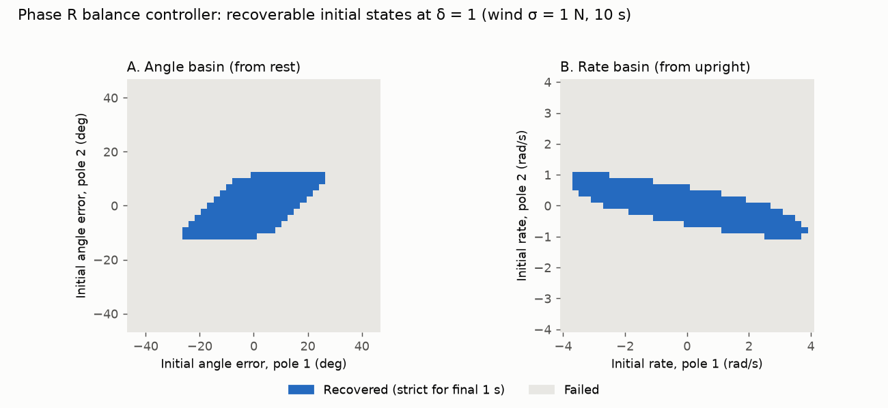

# Robustness report — Phase R swing-up + balance controller

Stress test of `src/control/swingup.py` (Phase 4.7 of `PROJECT_PLAN.md`), generated by `python tools/robustness_sweep.py` in 6 min.

All runs use the real `DoublePendulumCartEnv` at full difficulty (δ = 1: g = 9.81 m/s², frictionless, wind σ = 1 N per 5 ms step unless swept) driven through `ForceControl`. A run **succeeds** if the cart stays within |x| ≤ 3.5 m throughout and both poles are within 0.17 rad (≈ 10°) of upright for the whole final second. Swing-up runs last 20 s from the `down` reset (1 s settle, 4 s swing, 15 s balance); rates are over 10 seeds.

## Headline numbers

| Quantity | Recoverable |
|---|---:|
| Angle error, both poles, any sign combination (from rest) | ±6.9° |
| Angle error, same sign (Δθ₁ = Δθ₂) | ±11.5° |
| Angle error, opposite sign (Δθ₁ = −Δθ₂) | ±6.9° |
| Angular rate, both poles, any combination (from upright) | ±0.4 rad/s |
| Impulse on the cart while balancing (100 % of seeds) | 8 N·s |
| Impulse on the cart mid-swing (100 % of seeds) | 10 N·s |
| Wind σ (100 % of seeds) | 40 N |

The grid resolution is 2.3° for angles and 0.2 rad/s for rates, so basin radii are lower bounds to within one grid step. Impulse and wind limits are the largest *tested* values with 100 % success.

How to read the basins: each cell is one 10 s balance run starting at rest (A) or upright (B). Both basins are sheared parallelograms, not discs. In A, errors in which both poles lean the same way (the chain stays straight) are tolerated about twice as far as errors that bend the chain, which the cart can only correct by moving one way and then the other. In B the basin is a narrow band: large pole-1 rates are recoverable when pole 2 turns the other way at roughly a quarter of the rate, but a few tenths of a rad/s in the worst direction already fail. The swing-up hands over well inside both basins (errors < 0.1° at the end of the nominal), which is why the controller is reliable from hanging despite a small balance basin.

## C. Impulsive push on the cart

One 5 ms force pulse of impulse J (force J/0.005 s), 2 s after the swing ends (balancing) or 2 s into the 4 s swing.

| J [N·s] | 0.5 | 1 | 2 | 3 | 4 | 5 | 6 | 8 | 10 |
|---|---:|---:|---:|---:|---:|---:|---:|---:|---:|
| While balancing | 100 % | 100 % | 100 % | 100 % | 100 % | 100 % | 100 % | 100 % | 0 % |
| Mid-swing | 100 % | 100 % | 100 % | 100 % | 100 % | 100 % | 100 % | 100 % | 100 % |

## D. Wind (full swing-up)

| σ_w [N] | 1 | 5 | 10 | 20 | 30 | 40 | 60 |
|---|---:|---:|---:|---:|---:|---:|---:|
| Success | 100 % | 100 % | 100 % | 100 % | 100 % | 100 % | 90 % |

## E. Model mismatch (full swing-up, controller keeps the nominal model)

Plant parameter multiplied by the factor shown; nominal M = 1 kg, m₁ = m₂ = 0.5 kg, l₁ = l₂ = 1 m.

| Parameter | ×0.7 | ×0.8 | ×0.9 | ×1.1 | ×1.2 | ×1.3 |
|---|---:|---:|---:|---:|---:|---:|
| M | 100 % | 100 % | 100 % | 100 % | 100 % | 100 % |
| m1 | 0 % | 0 % | 100 % | 100 % | 100 % | 100 % |
| m2 | 0 % | 100 % | 100 % | 100 % | 10 % | 0 % |
| l1 | 0 % | 100 % | 100 % | 100 % | 0 % | 0 % |
| l2 | 0 % | 0 % | 0 % | 100 % | 0 % | 0 % |

| Unmodelled friction | Coefficient | Success |
|---|---:|---:|
| cart | 0.05 | 100 % |
| cart | 0.1 | 100 % |
| cart | 0.2 | 100 % |
| cart | 0.5 | 100 % |
| pole | 0.01 | 100 % |
| pole | 0.02 | 100 % |
| pole | 0.05 | 100 % |

## F. Actuator limit (full swing-up)

The nominal trajectory peaks at 26.4 N; feedback needs headroom above that.

| Force limit [N] | 20 | 25 | 27 | 30 | 35 | 40 | 60 |
|---|---:|---:|---:|---:|---:|---:|---:|
| Success | 0 % | 100 % | 100 % | 100 % | 100 % | 100 % | 100 % |

Reading E: cart mass and friction barely matter, because the cart is the actuated coordinate and feedback absorbs them. The pole parameters do matter: the swing is dominated by the feed-forward force profile, which is tuned to the chain's natural dynamics, and a ±10–20 % error in m₁, m₂ or l₁ (or even −10 % in l₂) puts the chain outside the TVLQR tube. Remedies, not implemented here: identify the parameters before planning, re-plan online (MPC), or optimise the trajectory over a set of parameter samples.

## G. Gain trade-off (LQR control weight R)

Same Q = diag(10, 100, 100, 1, 1, 1) throughout; R also sets the TVLQR tracking gains. Basin = fraction of an 11 × 11 grid of initial angle errors in ±0.5 rad (±29°) recovered from rest; wind = full swing-up at σ = 40 N.

| R | Largest gain | Basin fraction | Swing-up at σ = 40 N |
|---:|---:|---:|---:|
| 0.01 (default) | 837 | 25 % | 100 % |
| 1 | 263 | 39 % | 40 % |
| 3 | 233 | 42 % | 20 % |

High gain rejects disturbances; low gain tolerates larger initial errors (it is less violent, so the nonlinear chain stays closer to the linear model). The default favours disturbance rejection, since the swing-up delivers the chain to upright with errors well inside every basin here.
